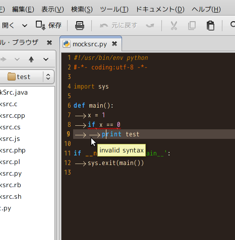

gedit用flymake的な何か「gfly」
	-- something like flymake for gedit "gfly" --

	使い方(How to use)
		gfl.gedit-pluginとgflyフォルダを~/.gnome2/gedit/pluginsにコピー
		copy "gfly.gedit-plugin" and "gfly/" to ~/gnome2/gedit/plugins
		
			~(home)/
				.gnome2/
					gedit/
						plugins/
							gfly.gedit-plugin
							gfly/
		
		編集→設定→プラグインでgflyを有効にする
		"edit"->"Preference"->"Plugins" and check "gfly"
		
		geditでC言語のプログラムを書く
		write *.c using gedit
		
		間違える
		make a mistake
		
		保存する
		Ctrl + S
		
		赤線が出る
		Get underlined
		
		直す
		fix
		
		カーソルをエラーに合わせるとtooltipが出ます
		appear tooltip when you put cursor on error
		
		Ctrl + 1 でエラーのある行にジャンプします
		jump to error line when you type Ctrl + 1
		
	注意(Notes)
		C言語での利用にはgccが必要です
		you need "gcc" for C
		
		C++での利用にはg++が必要です
		you need "g++" for C++
		
		Javaでの利用にはjavacが必要です
		you need "javac" for Java
		
		Javascriptでの利用にはgjslintが必要です
		you need "gjslint" for Javascript
		
		Pythonでの利用にはpyflakesもしくはpylintが必要です
		you need "pyflakes" or "pylint" for Python
		デフォルトではpyflakesを利用します
		default is "pyflakes"
		
		C#での利用にはgmcsが必要です
		you need "gmcs" for C#
		
		Perlでの利用にはperlが必要です
		you need "perl" for Perl
		
		PHPでの利用にはphpが必要です
		you need "php" for PHP
		
		Rubyでの利用にはrubyが必要です
		you need "ruby" for Ruby
		
	キーバインディングを変更したい(You want to change key binding)
		__init__.pyを編集
		edit __init__.py
		
		geditを再起動
		restert gedit
	
	言語を増やしたい(You want to use other language)
		「なんとかErrorGenerator.py」を追加してください
		add "---ErrorGenerator.py"
		
		「__init__.py」の「errorGenerator」にインスタンスを追加するとたぶんうまくいきます
		add that instance to "errorGenerator" of "__init__.py", and maybe success
	
	書いた人(Author)
		Masatoshi Tsushima
		Twitter: @utisam

	変更履歴(Change Log)
		bashに対応
		gjslintに対応
		pyflakes, rubyに対応
		pycheckerからpylintに変更
		perlとPHPを追加
		C++とJavaとPython
		Cのみで作成

